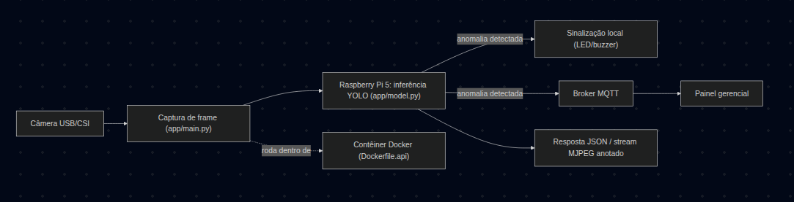

# Detecção de Anomalias Estruturais em Recipientes em Linhas de Envase

Somos o Grupo Git Push. Este é o README inicial do nosso Trabalho de Conclusão da Capacitação (PNAAT). Aqui o problema que estamos resolvendo, como implementamos a arquitetura, do que o projeto depende e como rodar.

## Sumário

- [O problema que estamos resolvendo](#o-problema-que-estamos-resolvendo)
- [Como implementamos a arquitetura](#como-implementamos-a-arquitetura)
- [O que já está implementado](#o-que-já-está-implementado)
- [Do que precisa para executar](#Do-que-precisa-para-executar)
- [Estrutura do repositório](#estrutura-do-repositório)
- [Como rodar](#como-rodar)
- [Onde estamos agora](#onde-estamos-agora)

## O problema que estamos resolvendo

Em uma linha de envase rápido, garrafas e recipientes com anomalias estruturais (ausência de tampa, tampa mal rosqueada, corpo deformado) continuam passando pela esteira sem nenhuma verificação automatizada, até travarem o maquinário, derramarem líquido ou comprometerem um lote inteiro. Nossa ideia é detectar essas anomalias em tempo real, antes do recipiente chegar ao empacotamento, e sinalizar o problema para o operador intervir. Não pretendemos remover fisicamente a peça nem parar a esteira sozinhos, isso continua manual, é uma escolha de escopo, não uma limitação técnica.

## Como implementamos a arquitetura

Escolhemos uma abordagem predominantemente de visão computacional, porque as três anomalias que definimos são identificáveis numa única captura de imagem, sem precisar de um sensor dedicado por tipo de defeito. É assim que pensamos o fluxo completo:



Explicação: a entrada é a câmera capturando os recipientes, via CSI ou USB. O processamento acontece no Raspberry Pi 5, que roda a inferência YOLO sobre cada frame. O resultado sai de duas formas hoje, como resposta JSON com as detecções, ou como vídeo anotado ao vivo pelo stream. A sinalização local e o alerta MQTT para o painel gerencial são a camada de IoT prevista na proposta, que liga a detecção da visão computacional a uma reação prática na linha.

## O que já está implementado

A API em FastAPI (`app/main.py`) já cobre boa parte de visão computacional. Os endpoints que já funcionam:

- `GET /health`, verifica se a API está de pé e qual modelo está carregado.
- `POST /predict`, roda a inferência numa imagem enviada em base64 ou por URL.
- `GET /predict/camera` e `GET /predict/camera/image`, disparam uma captura da câmera do Raspberry Pi (CSI via `rpicam-still`, ou USB via OpenCV como alternativa) e retornam a detecção.
- `POST /predict/batch`, roda a inferência em várias imagens de uma vez.
- `GET /stream/camera` e `GET /stream/view`, transmitem vídeo contínuo da câmera com as detecções desenhadas em cada frame, direto no navegador.
- `GET /metrics`, acompanha quantas inferências já rodaram e o tempo médio.

O que ainda não está implementado é a camada de IoT, o acionamento do LED/buzzer e a publicação do alerta MQTT.

Também já temos um pipeline de CI/CD (`.github/workflows/edge-deploy.yml`) que roda lint, testes, builda a imagem Docker para ARM64 e faz o deploy automático no Raspberry Pi 5 via SSH, com um portão de qualidade (`scripts/validate_model.py`) que bloqueia o deploy se o modelo treinado tiver mAP@0.5 abaixo de 0.50.

## Do que precisa para executar

**Hardware**
- Câmera USB ou módulo CSI
- Raspberry Pi 5, como unidade de processamento de borda
- LED/buzzer para sinalização local 

**Bibliotecas Python (API, em `app/requirements.txt`)**
- fastapi
- uvicorn
- ultralytics, para o modelo YOLO
- Pillow, numpy, opencv-python-headless, para manipulação de imagem
- httpx

**Instaladas direto no `Dockerfile.api` (fora do requirements.txt)**
- torch e torchvision, versão CPU, dependências do ultralytics para rodar a inferência

**Dependências de sistema (também no `Dockerfile.api`)**
- rpicam-apps-lite, do repositório da Raspberry Pi Foundation, para a câmera CSI
- libgl1, libglib2.0-0, libgomp1, bibliotecas exigidas pelo OpenCV e pelo PyTorch em tempo de execução

**Bibliotecas Python (cliente de teste, em `client/requirements.txt`)**
- httpx
- Pillow

**Ainda vamos adicionar**
- Uma biblioteca de MQTT (tipo paho-mqtt), quando a camada de alerta for implementada

**Plataformas e ferramentas**
- Roboflow, para anotação do dataset
- DVC, para versionar dataset e modelo treinado
- Docker e Docker Compose, para empacotar API e cliente
- Um broker MQTT (ainda vamos decidir qual, depende de como o painel gerencial for montado)
- pytest, para os testes automatizados
- ruff, para lint do código Python
- GitHub Actions, para o pipeline de CI/CD (lint, testes, build da imagem e deploy)
- Tailscale, para o pipeline de CI/CD alcançar o Raspberry Pi durante o deploy
- GitHub Container Registry (GHCR), para hospedar a imagem Docker publicada

## Estrutura do repositório

```
.
├── README.md
├── docker-compose.yml
├── Dockerfile.api
├── Dockerfile.client
├── ruff.toml
├── .github/
│   └── workflows/
│       └── edge-deploy.yml   # CI/CD: lint, testes, build ARM64, quality gate, deploy
├── app/
│   ├── main.py           # endpoints da API, captura de câmera e streaming
│   ├── model.py           # carregamento do modelo YOLO
│   ├── schemas.py         # formatos de request/response da API
│   └── requirements.txt
├── client/
│   ├── client.py          # script de teste que chama a API com imagens locais
│   └── requirements.txt
├── models/
│   └── yolov8n.pt.dvc     # ponteiro DVC do modelo, hoje ainda o genérico
├── scripts/
│   ├── deploy.sh           # reinicia o serviço no Raspberry Pi, com rollback automático
│   └── validate_model.py   # quality gate: bloqueia deploy se o mAP@0.5 ficar abaixo do limiar
├── tests/
│   ├── test_api.py
│   └── assets/
└── docs/
    └── diagrama-arquitetura.png
```


## Como rodar

```bash
git clone https://github.com/leonardo897/yolo-bottle-inference
cd yolo-bottle-inference
dvc pull                     # baixa o modelo
docker compose up --build
```

Com os containers rodando, a API fica em `http://localhost:8000`, com a documentação interativa em `http://localhost:8000/docs` e o stream ao vivo em `http://localhost:8000/stream/view`.

## Onde estamos agora

A API e o pipeline de inferência já estão funcionando com o modelo genérico (`yolov8n.pt`). Já fotografamos os recipientes de duas das classes, sem defeito e tampa ausente, e estamos anotando esse dataset no Roboflow para treinar o modelo customizado. Faltam a outra classe (corpo deformado), o treino do modelo final, e a camada de alerta local e MQTT, que ainda não tem código escrito.