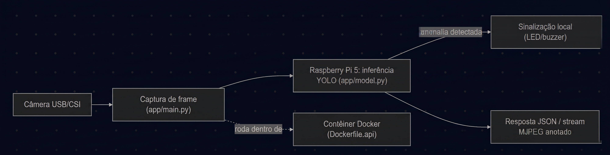
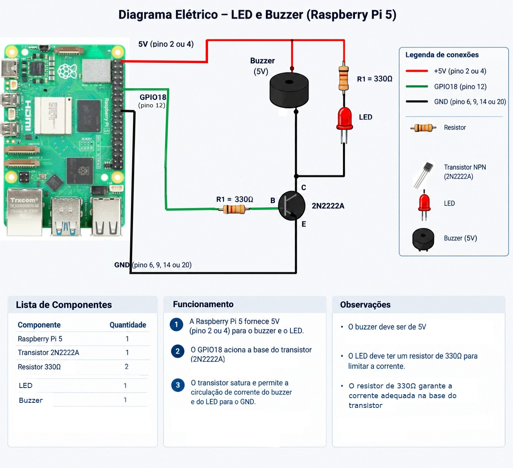

# Detecção de anomalias em garrafas

Projeto de visão computacional do Grupo Git Push para identificar anomalias estruturais em garrafas em uma linha de envase. A solução usa um modelo YOLO executado por uma API FastAPI. O script `scripts/detector_garrafas.py` consulta essa API continuamente e aciona um LED e um buzzer quando encontra uma classe de anomalia.



## Visão geral

O fluxo de execução é:

1. Uma câmera CSI ou USB conectada ao Raspberry Pi captura a imagem.
2. O container `yolo-api` recebe a imagem, aplica o pré-processamento e executa a inferência YOLO.
3. O endpoint `POST /predict/camera` devolve as detecções em JSON.
4. `detector_garrafas.py` filtra as classes de interesse e, quando necessário, liga o LED e o buzzer no GPIO 18.

As classes que acionam o alarme são `Garrafa amassada`, `Tampa incorreta` e `Tampa ausente`. O limiar de confiança padrão do detector é `0.3`.

## Componentes

- Raspberry Pi 5 ou equipamento compatível para executar a API e acessar a câmera.
- Câmera CSI ou USB.
- LED e buzzer ligados ao GPIO 18, com o circuito elétrico apropriado.
- Docker e Docker Compose.
- Git e DVC, para obter o código e o modelo versionado.
- Python 3.11 ou superior no equipamento que executará o detector.

O modelo utilizado pela execução final é `yolo-epi.pt`. O arquivo não fica armazenado diretamente no Git: `models/yolo-epi.pt.dvc` é um ponteiro DVC que baixa o peso para `models/yolo-epi.pt`.



## Estrutura principal

```text
.
├── app/
│   ├── main.py                 # API, captura da câmera e endpoints
│   ├── model.py                # carregamento e cache dos modelos
│   └── requirements.txt        # dependências da API
├── client/                     # cliente de testes da API
├── dataset/                    # conjunto de imagens de treino, teste e validação
├── models/
│   └── yolo-epi.pt.dvc         # ponteiro DVC do modelo final
├── preprocessing/              # pré-processamento e ajuste das caixas
├── scripts/
│   └── detector_garrafas.py    # loop do alarme local
├── stream/                     # streaming MJPEG e variações de captura
├── tests/                      # testes automatizados
├── docker-compose.yml          # serviços da API, cliente e stream
├── Dockerfile.api
└── Dockerfile.client
```

## API disponível

Com a API em execução, os endereços principais são:

- `GET /health`: verifica se a API está disponível e se o modelo padrão foi carregado.
- `POST /predict/camera`: captura uma imagem e retorna as detecções em JSON.
- `GET /predict/camera/image`: captura uma imagem e retorna a versão anotada.
- `POST /predict`: executa inferência em uma imagem enviada em base64 ou por URL.
- `GET /stream/view`: exibe o stream anotado no navegador.
- `GET /metrics`: exibe as métricas de inferência.
- `GET /docs`: abre a documentação interativa do FastAPI.

O serviço usa `yolo-epi.pt` por padrão no Compose, expõe a porta `8000` e monta a pasta `models` como somente leitura. A captura CSI usa `rpicam-still`; para câmeras USB, a API tenta usar OpenCV como alternativa.

## Aquisição e execução completa

Os passos abaixo partem de uma máquina nova e terminam com a execução do detector.

### 1. Obter o repositório

```bash
git clone https://github.com/leonardo897/yolo-bottle-inference.git
cd yolo-bottle-inference
```

Para conferir o código obtido:

```bash
git status
```

O diretório deve conter `docker-compose.yml`, `app/`, `models/` e `scripts/detector_garrafas.py`.

### 2. Baixar o modelo com DVC

Instale o DVC caso ele ainda não esteja disponível e faça o pull do artefato:

```bash
python3 -m pip install dvc
dvc pull models/yolo-epi.pt.dvc
```

Confirme que o peso foi materializado:

```bash
ls -lh models/yolo-epi.pt
```

O arquivo deve existir antes da subida dos containers. O acesso ao remoto DVC configurado para o projeto também é necessário; sem ele, o ponteiro `.dvc` não consegue baixar o modelo.

### 3. Subir a API e a câmera

Na máquina que possui a câmera, execute:

```bash
docker compose up -d --build
docker compose ps
```

O primeiro build instala Python, PyTorch CPU, Ultralytics, OpenCV e as ferramentas de câmera. O serviço `yolo-api` fica disponível na porta `8000`; o stream, quando utilizado, fica na porta `5000`.

Valide o serviço e o modelo:

```bash
curl -f http://localhost:8000/health
curl -X POST "http://localhost:8000/predict/camera?model_name=yolo-epi.pt&confidence=0.3"
```

O primeiro comando deve retornar JSON semelhante a:

```json
{"status":"ok","model_loaded":true,"model_name":"yolo-epi.pt"}
```

O segundo deve retornar um JSON com `detections`, `inference_ms`, `model_used`, `image_width` e `image_height`. `detections` pode ser uma lista vazia quando não houver garrafa ou anomalia no campo de visão; isso não indica falha da API.

Para acompanhar logs e encerrar os serviços:

```bash
docker compose logs -f yolo-api
docker compose down
```

### 4. Preparar o equipamento do detector

O detector pode ser executado no próprio Raspberry Pi ou em outro equipamento Linux ligado ao circuito. Ele precisa alcançar o endereço da API e ter acesso ao GPIO 18. No ambiente Python do equipamento do detector:

```bash
python3 -m venv .venv
source .venv/bin/activate
python -m pip install --upgrade pip
python -m pip install requests gpiozero
```

O `gpiozero` considera a numeração BCM; portanto, `GPIO_PIN = 18` significa o GPIO BCM 18, e não necessariamente o pino físico 18 do header. Ligue LED e buzzer com resistor e/ou driver adequado ao circuito conforme o diagrama elétrico.


### 5. Configurar o endereço da API

Abra `scripts/detector_garrafas.py` e ajuste:

```python
API_URL = "http://ENDERECO_DA_MAQUINA_DA_API:8000/predict/camera"
```

O valor versionado atualmente aponta para `http://100.78.45.107:8000/predict/camera`. Esse endereço só funcionará se a API estiver realmente acessível nesse IP, por exemplo, pela rede configurada do projeto. Se API e detector estiverem no mesmo Raspberry Pi, use `http://127.0.0.1:8000/predict/camera`.

Antes de iniciar o loop, teste o mesmo host pelo equipamento do detector:

```bash
curl -f http://ENDERECO_DA_MAQUINA_DA_API:8000/health
```

### 6. Executar `detector_garrafas.py`

Com a câmera, a API e o circuito prontos:

```bash
source .venv/bin/activate
python scripts/detector_garrafas.py
```

O programa permanece em execução até `Ctrl+C`. A cada ciclo ele chama a API, verifica as detecções das três classes-alvo e aplica um cooldown de `1.0` segundo entre alarmes. O LED e o buzzer ficam ligados por `0.5` segundo quando uma detecção válida dispara o alarme.

## Resultado esperado

Ao iniciar corretamente, o terminal deve mostrar mensagens equivalentes a:

```text
Consultando http://...:8000/predict/camera
Modelo: yolo-epi.pt | confiança mínima: 0.3
Classes gatilho: {'Garrafa amassada', 'Tampa incorreta', 'Tampa ausente'}
Alarme: 0.5s ON | cooldown 1.0s
Ctrl+C para sair.
```

Com uma cena sem anomalia, o detector continua consultando a API sem imprimir alarme e mantém o GPIO desligado. Ao apresentar uma garrafa correspondente a uma classe-alvo e com confiança igual ou maior que `0.3`, deve aparecer uma linha semelhante a:

```text
[... ] 🚨 Tampa ausente(0.87) | alarme ON por 0.5s
```

Nesse momento, o LED e o buzzer devem ligar por meio segundo. Ao pressionar `Ctrl+C`, o programa deve mostrar `Encerrado.` e `Saída GPIO desligada. Tchau!`, deixando as saídas desligadas.

Erros com prefixo `[api] erro:` indicam que o detector iniciou, mas não conseguiu consultar a API ou interpretar sua resposta. Nesse caso, verifique o IP, a porta `8000`, a conectividade, o estado do container e a câmera. Se a API estiver respondendo, mas não houver alarme, confirme iluminação, enquadramento, classe detectada e o limiar de confiança.

## Desenvolvimento e validação

Os testes ficam em `tests/` e o lint é configurado em `ruff.toml`. Com as dependências de desenvolvimento instaladas, podem ser executados com:

```bash
pytest
ruff check .
```

O deploy automatizado usa GitHub Actions e `scripts/deploy.sh`, que atualiza a imagem, executa o `dvc pull`, sobe os serviços e valida o endpoint `/health` antes de concluir.
